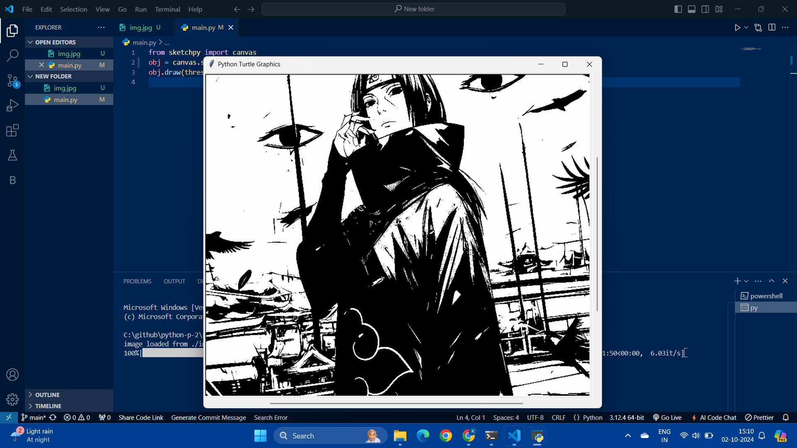

# Installing required python packages
we need to download important packages for this application.

Open your terminal and run the following command.
- sketchpy:
```terminal
pip install sketchpy
```
*Now that we have the packages, we are ready to import it in our python script.*
```py
from sketchpy import canvas
```
### skechpy:
*Sketchpy is a Python module that allows you to create drawings and animations using the turtle graphics library. It’s a fun way to explore basic animation and create visual art right in Python.*

### canvas : 
*To create a drawing surface within your application.It’s like having a blank canvas where you can place various graphical elements: lines, rectangles, ovals, polygons, text, and images.*

## OUTPUT:

